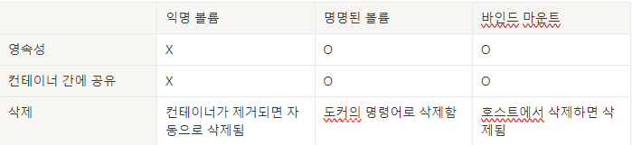

# Docker

## 도커란?

Go언어로 작성된 리눅스 컨테이너 기반으로 하는 오픈소스 가상화 플랫폼이다. 서비스를 패키징하고 배포하는데 유용한 오픈소스 프로그램이다.
컨테이너에는 라이브러리, 시스템 도구, 코드, 런타임 등 소프트웨어를 실행하는데 필요한 모든 것이 포함되어 있다.
가상 머신에 비해 꼭 필요한 것만 담겨서 구동되기 때문에 이미지를 만들 경우 용량이 대폭 줄어들게 된다.

도커를 왜 사용할까?

1. 애플리케이션 독립성을 가진다. 호스트 OS, 다른 컨테이너와도 독립된 공간을 보장받아 충돌이 발생하지 않는다.
2. 컨테이너 내부에 작업 후 배포하려 한다면 도커 이미지로 만들어서 운영서버에 전달만 하면 된다.
3. 마이크로 서비스 구조로 변화가 쉽다. 컨테이너 하나당 하나의 기능을 제공하는 모듈로 만드는 등 조정이 가능하다.
   Docker을 사용하면 환경에 구애받지 않고 애플리케이션을 신속하게 배포, 확장할 수 있다.

### 도커 이미지, 컨테이너 란?

도커 이미지란?
Docker Image란 컨테이너를 실행할 수 있는 실행파일, 설정 값들을 가지고 있는 것으로,
더 이상 의존성 파일을 컴파일하거나 이것저것 설치할 필요가 없는 상태의 파일을 의미한다.
Image를 컨테이너에 담고 실행시키면 해당 프로세스가 동작하며, 수정이 불가능하다.
만약 수정을 원할 경우에는 새로운 이미지를 다시 빌드 해줘야 한다.

도커 이미지의 생성 방식은?
도커 이미지는 기존 이미지에 추가적인 구성이 필요할 때 다시 다운로드하는 방법이 아닌
기존이미지에 레이어를 추가하여 구성을 올려주는 방식으로 생성된다.
이미지는 여러 개의 읽기 전용 레이어로 구성되고 파일 추가되면 새로운 레이어가 생성되어 추가된다.
도커는 여러 개의 레이어를 묶어 하나의 파일시스템으로 사용할 수 있게 해 준다.

이미지와 컨테이너의 차이

간단하게 설명하면 도커 이미지는 설계서, 컨테이너는 설계서로 만들어진 상품이다.
게다가 이미지가 중간에 바꾸게 되더라도 기존 컨테이너는 더 이상 이미지에 영향을 받지 않는다.

컨테이너의 정의 및 특징?
정의
Docker container란 이미지를 실행한 상태로 응용프로그램의 종속성과 함께 응용프로그램 자체를
패키징 Or 캡슐화하여 격리된 공간에서 프로세스를 동작시키는 기술이다.

특징
컨테이너는 이미지 레이어에 읽기/쓰기 레이어를 추가하는 것으로 생성됨
종료되었다고 해도 삭제되지 않음 -> 읽기/쓰기 레이어 보존
컨테이너를 삭제한 것은 생성파일이 사라지는 것
한 서버는 여러 개의 컨테이너를 가져도 상관없으며 독립적으로 실행
컨테이너는 커널 공간과 호스트 os자원을 공유

도커 파일
Doker File은 이미지 생성 출발점으로 이미지를 구성하기 위한 명령어들을 작성하여 이미지를 구성할 수 있다.
만들 이미지에 대한 정보를 기술한 템플릿이라고 보면 된다.
이를 빌드하면 자동으로 이미지가 생성된다. 그러므로 도커 파일을 통해 애플리케이션 빌드 및 배포를 자동화할 수 있다.

## 레이어(Layer)란?

레이어란 기존 이미지에 추가적인 파일이 필요할 때 다시 다운로드 받는 방법이 아닌 해당 파일을 추가하기 위한 개념이다.

도커 이미지는 컨테이너를 생성하기 위한 모든 정보를 갖고 있기 때문에 보통 수백MB ~ 수GB가 넘는다.
그런데 기존 이미지에서 작은 변경사항이 생겨 도커 파일에 코드를 추가해 다시 이미지를 만들고 그 이미지를 다운받으면 이미지의 불변성 때문에 큰 용량을 가진 이미지를 다시 다운로드 받는것은 매우 비효율적인 방법이다.

Docker는 이러한 문제를 해결하기 위해 Layer(레이어)라는 개념을 도입했다.

만약 ubuntu 이미지가 기존에 존재하는데 nginx 이미지를 다운 받을 경우 nginx 레이어만 다운받게 된다.
Docker 이미지는 위 그림 처럼 여러 레이어로 구성되며, 각 레이어는 이전 레이어의 변경 사항을 가지고 있다.
이 여러 개의 레이어에는 읽기 전용인 read only 레이어와, 새로 변경되거나 추가된 내용을 담은 새로운 레이어로 구성된다.
도커 이미지에 작업이 추가되면 새로운 레이어가 생성되는 이러한 개념은 Git 레포지토리에 commit 로그를 쌓는 것과 같다고 볼 수 있다.

기존에는 이미지에 변경사항이 생겨 새 이미지를 받아와야 되었다면,
이제는 레이어 개념을 통해 기존 레이어는 그대로 둔 채 새로 업데이트된 내용만 담고 있는 레이어만 쌓는 개념으로 관리를 하기 때문에 효율적이다.
업데이트된 부분만을 이미지로 생성하고 실행 시점에 기존 이미지를 바뀐 부분과 조합하기 때문에 바뀐 이미지의 크기는 큰 변화가 없다.  (Git 레포지토리에서 업데이트된 코드를 pull 받는 것과 같다.)

이미지를 실행하여 도커 컨테이너를 생성할 때도 레이어 방식을 사용한다.
컨테이너 생성 시, 기존의 읽기 전용 이미지 레이어 위에 읽기/쓰기 전용 레이어(R/W layer) 를 추가한다.
이미지 레이어를 그대로 불변의 레이어로 사용하면서, 컨테이너가 애플리케이션 실행 중에 생성하는 모든 파일이나 변경사항은 읽기/쓰기 전용 레이어에 저장되므로
여러 개의 컨테이너를 실행하면서 이미지는 불변성을 유지할 수 있다.

### 도커 레이어의 특징

- 레이어 격리: 각 레이어는 독립적인 파일 시스템으로, 각 레이어에 애플리케이션과 종속성에 대한 변경 사항만 포함된다.
- 레이어 재사용: 동일한 레이어를 여러 이미지에 공유할 수 있다. 이를 통해 이미지 빌드 시간과 저장소 사용량을 줄일 수 있다.
- 레이어 버전 관리: 레이어를 생성할 때마다 새로운 버전이 만들어진다. 이렇게 되면, 이미지 업데이트 시에도 이전 버전의 레이어를 유지할 수 있어, 애플리케이션의 변경 이력을 관리할 수 있다.
- Dockerfile 기반 레이어 생성: Dockerfile에서 작성된 명령어들이 각각 실행될 때마다 새로운 레이어가 만들어진다. 이렇게 하여 애플리케이션과 그에 상응하는 설정, 라이브러리, 종속성 등의 변경 사항을 추적할 수 있다.

### 도커 레이어의 작동 원리

- Docker 이미지를 생성할 때, Dockerfile을 사용하여 이미지 레시피를 정의
- Dockerfile에 기술된 명령어들이 순서대로 실행.
- 각 명령어가 실행될 때마다 새로운 레이어가 생성되고, 변경 사항이 레이어에 저장
- Docker 이미지를 실행할 때, 해당 이미지의 모든 레이어가 연결되어 전체 파일 시스템을 구성. 이렇게 하여 실행하는 컨테이너는 모든 레이어의 데이터에 액세스할 수 있다.
- 컨테이너 내에서 변경해 저장한 것은 컨테이너의 최상단 레이어에 저장되며 이미지의 레이어에는 영향을 주지 않는다.

## volume이란?

Docker Volume은 Docker에 의해 만들어지고 관리되는 하나의 Volume이다.
주로 Host의 /var/lib/docker/volumes/ 경로에 저장되며, Container에 마운트하지 않아도 미리 생성이 가능하다.

### 익명 볼륨, 명명된 볼륨

볼륨의 종류는 두가지가 있다.

- 익명 볼륨: 익명 볼륨은 컨테이너가 사라질 때 같이 사라지는 볼륨이다
- 명명된 볼륨: 명명된 볼륨은 컨테이너가 사라져도 사리지지 않는 영구적으로 보존되는 볼륨이며, 이 볼륨을 사용하여 여러 컨테이너 간에 데이터를 공유할 수 있다. 삭제는 도커의 명령으로 삭제된다.

## Bind mount란?

Docker volume을 사용하지 않고 Host의 디렉토리에 직접 Access하는 것을 말한다.
Host의 디렉토리와 서로 공유함으로써 Container가 지워지더라도 Host에 남게되어 데이터를 보존할 수 있다.
삭제는 도커의 명령으로 불가능하고 호스트에서 삭제해야 한다.

## Volume vs Bind mount

볼륨은 도커 컨테이너에서 생산되고 사용되는 데이터를 영구적으로 저장하기 위한 방법이다.
볼륨은 도커에 의해 완전히 관리된다.
바인드 마운트는 호스트 머신의 디렉토리 구조나 OS에 의존적이고 호스트 머신의 파일들을 도커 컨테이너에 덮어쓴다.

볼륨: 도커에서 파일을 관리
바인드 마운트: 호스트 머신에서 파일을 관리

볼륨은 바인드 마운트에 비해 다음의 장점을 가진다.

- 바인드 마운트보다 백업하거나 마이그레이트 하기 휩다
- Docker CLI 커맨드나 Docker API를 활용해 관리할 수 있다.
- 리눅스, 윈도우 컨테이너 모두에서 작동한다.
- 여러 컨테이너 간 공유할 때 더 안전하다.
- 볼륨 드라이버는 리모트 호스트나 클라우드 공급사에 볼륨을 하거나, 내용을 해독, 다른 기능을 더할 수 있도록 한다.
- 새로운 볼륨은 컨테이너에 의해 이미 생성된 컨텐트를 가질 수 있다.
- Docker Desktop의 볼륨은 백, 윈도우 호스트의 바인드 마운트보다 성능이 높다.

docker run을 사용할 때 --v 옵션을 사용하는 기본적인 세 가지 방식

- docker run -v /app/data ... (익명 볼륨)
- docker run -v data:/app/data ... (명명된 볼륨)
- docker run -v /path/to/code:/app/code ... (바인드 마운트)

